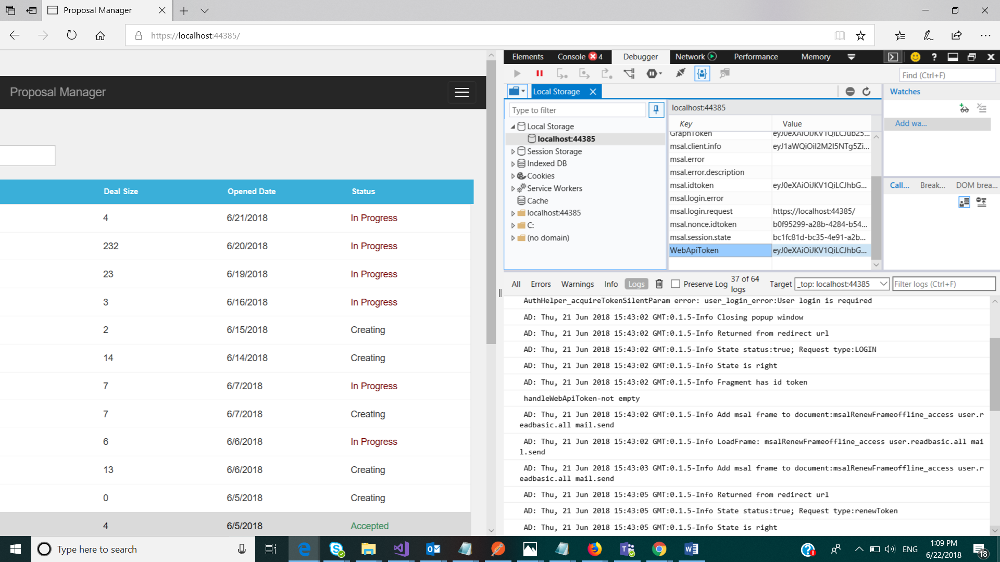
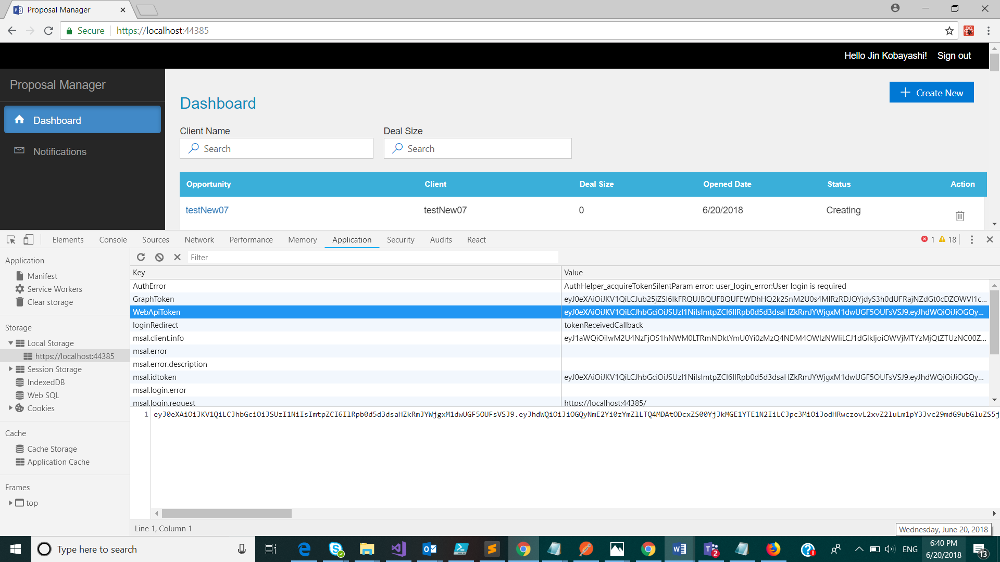

## Guide for using the Opportunity API

This guide is created for consuming the rest API using the Postman tool.

### Sections:
[Create Opportunity](./Opportunity/CreateOpportunity.md)
 
[Get Opportunity](./Opportunity/GetOpportunity.md)
 
[Update Opportunity](./Opportunity/UpdateOpportunity.md)
 
[Upload Checklist Document](./Opportunity/UploadChecklistDocument.md)
 
[Upload Proposal Document](./Opportunity/UploadProposalDocument.md)
 
[Delete Opportunity](./Opportunity/DeleteOpportunity.md)

### Important Points:

 Postman is installed on the machine

- Download link: [https://www.getpostman.com/apps](https://www.getpostman.com/apps)

- Sending API requests from postman: [https://www.getpostman.com/docs/v6/postman/sending\_api\_requests/requests](https://www.getpostman.com/docs/v6/postman/sending_api_requests/requests)

You have to login in to the proposal manager application with the valid user who is authorized to carry out the required transaction. This is required for grabbing the &quot;webApi token&quot; to be used while invoking the API. Token validity may be for a short duration. If you get a 401 unauthorized response, please try to sign-in to the application again and fetch a fresh token.  Below screenshots are for fetching the token from different browsers:

 Edge

Chrome

 

Firefox

 

- Your machine allows calling the api(hosted on azure) , no firewall or proxy blocking the same.
- Url used is  \{hostedAppUrl}/api/opportunity. This same url will be used for all CRUD operations.
[Sample opportunity json object](SampleOpportunityJson.txt)

